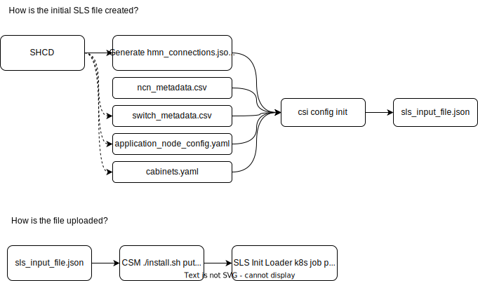

# SLS Overview

## What is currently stored in SLS?

## Hardware information

* Source of truth for HMS Services (MEDS, REDS, HMS-Discovery, and HSM) when trying to identify and discovery new hardware in the system.
* Partial topology of the HMN network. SLS currently has cabling information about how the BMCs on the River HMN are connected . BMC <-> Leaf (CSM 1.0)/Leaf BMC (CSM 1.2+) Management switches.
* Role, Subrole, NID, and Alias information for nodes (Management, Compute, Application).
* Management switches with their aliases
* SLS currently has the following hardware types populated in it:

    * Cabinet
    * ChassisBMC – Hill/Mountain only
    * CabinetPDUController
    * RouterBMC
    * MgmtSwitchConnector – River Only
    * MgmtSwitch – River Only
    * MgmtHLSwitch – River Only
    * MgmtCDUSwitch – Mountain/Hill
    * Node

### Network Information

* SLS is the authority for the prescribed layout of management networking on the system.
* A SLS Network is…
  * A logical concept. CIDR/IP Address ranges have been for a specific purpose. 
  * Examples include: 
     * Node Management Network (NMN),
     * Hardware Management Network (HMN)
     * Customer Access Network (CAN)
  * A network is broken into smaller subnets (/22) that fit within the networks CIDR (/17)
* An SLS Subnet can consist of
  * DHCP Address pool
  * VLAN Information
  * IP Reservations: IP Address, Name, and Aliases
* Examples include:
  * HMN Management Network Infrastructure
  * HMN Bootstrap DHCP Subnet
  * NMN UAIs

## What services interact with SLS?

* hms-discovery cronjob
  * River HMN Cabling information to identify unknown hardware
  * Listing of Management Switches in the System to query via SNMP
* REDS
  * Listing of Management NCNs and Columbia Switches
* MEDS
  * Queries SLS for which Mountain/Hill cabinets are in the system
* Hardware State Manager (HSM)
  * Role, Subrole, and NID information
* KEA – DHCP
  * DHCP Subnet ranges
* Unbound – DNS
  * IP Reservations to populate static DNS records. Examples include: packages.local, registry.local, and api-gw-service-nmn.local
  * Node Alias information. Example: for the node `x3000c0s19b1n0`, SLS creates a DNS entry for the friendly name `ncn-000001-nmn` automatically.
* PowerDNS – DNS
  * IP Reservations to populate DNS
* CANU



## Examples 

### Example Hardware Data - Node

**Note: River and Mountain computes look the same**

```
ncn-m001:~ # cray sls hardware describe x3000c0s19b3n0 --format json | jq
{
  "Parent": "x3000c0s19b3",
  "Xname": "x3000c0s19b3n0",
  "Type": "comptype_node",
  "Class": "River",
  "TypeString": "Node",
  "LastUpdated": 1643152302,
  "LastUpdatedTime": "2022-01-25 23:11:42.908697 +0000 +0000",
  "ExtraProperties": {
    "Aliases": [
      "nid000003"
    ],
    "NID": 3,
    "Role": "Compute"
  }
}
```

```
ncn-m001:~ # cray sls hardware describe x3000c0s3b0n0 --format json | jq
{
  "Parent": "x3000c0s3b0",
  "Xname": "x3000c0s3b0n0",
  "Type": "comptype_node",
  "Class": "River",
  "TypeString": "Node",
  "LastUpdated": 1646770563,
  "LastUpdatedTime": "2022-03-08 20:16:03.177148 +0000 +0000",
  "ExtraProperties": {
    "Aliases": [
      "ncn-m002"
    ],
    "NID": 100002,
    "Role": "Management",
    "SubRole": "Master"
  }
}
```

### Example Hardware Data - MgmtSwitchConnector

```
ncn-m001:~ # cray sls search hardware list --node-nics x3000c0s19b3 --format json | jq .[]
{
  "Parent": "x3000c0w22",
  "Xname": "x3000c0w22j35",
  "Type": "comptype_mgmt_switch_connector",
  "Class": "River",
  "TypeString": "MgmtSwitchConnector",
  "LastUpdated": 1643152302,
  "LastUpdatedTime": "2022-01-25 23:11:42.908697 +0000 +0000",
  "ExtraProperties": {
    "NodeNics": [
      "x3000c0s19b3"
    ],
    "VendorName": "ethernet1/1/35"
  }
}
```

A MgmtSwitchConnector object represents a switch port on a Management Switch in the system (specifically a Leaf (CSM 1.0 and before), or a Leaf BMC (CSM 1.2 and after)

This SLS hardware object is the glue for how River hardware discovery currently works. When an unidentified MAC address is present in HSM EthernetInterfaces the HMS-Discovery job looks at the MAC address tables of all of the leaf switches in the system looking for the MAC address. When the MAC is found  in a switch SLS is consulted to determine the identity of the BMC. If identified a Redfish Endpoint is created in HSM, and the BMC is inventoried/discovered.

### Example Hardware Data - Cabinet

```
ncn-m001:~ # cray sls hardware describe x3000 --format json  | jq .Children=null
{
  "Parent": "s0",
  "Children": null,
  "Xname": "x3000",
  "Type": "comptype_cabinet",
  "Class": "River",
  "TypeString": "Cabinet",
  "LastUpdated": 1643152302,
  "LastUpdatedTime": "2022-01-25 23:11:42.908697 +0000 +0000",
  "ExtraProperties": {
    "Networks": {
      "cn": {
        "HMN": {
          "CIDR": "10.107.0.0/22",
          "Gateway": "10.107.0.1",
          "VLan": 1513
        },
        "NMN": {
          "CIDR": "10.106.0.0/22",
          "Gateway": "10.106.0.1",
          "VLan": 1770
        }
      },
      "ncn": {
        "HMN": {
          "CIDR": "10.107.0.0/22",
          "Gateway": "10.107.0.1",
          "VLan": 1513
        },
        "NMN": {
          "CIDR": "10.106.0.0/22",
          "Gateway": "10.106.0.1",
          "VLan": 1770
        }
      }
    }
  }
}
```

### Example Network Data - Networks

`CSM 1.2`

```
ncn-m001:~ # cray sls networks list --format json | jq .[].Name -r | sort
BICAN
CAN
CHN
CMN
HMN
HMNLB
HMN_RVR
HSN
MTL
NMN
NMNLB
NMN_RVR
```

### Example Network Data - Networks

* Overall Network CIDR
* Network name
* BGP ASN Information (CSM 1.2+)

```
ncn-m001:~ # cray sls networks describe NMN --format json | jq '.ExraProperties.Subnets=null'
{
  "Name": "NMN",
  "FullName": "Node Management Network",
  "IPRanges": [
    "10.252.0.0/17"
  ],
  "Type": "ethernet",
  "LastUpdated": 1646770563,
  "LastUpdatedTime": "2022-03-08 20:16:03.300142 +0000 +0000",
  "ExtraProperties": {
    "CIDR": "10.252.0.0/17",
    "MTU": 9000,
    "MyASN": 65533,
    "PeerASN": 65533,
    "Subnets": null,
    "VlanRange":[
      2
    ]
```

### Example Network Data - Subnet IP Reservations

```
ncn-m001:~ # cray sls networks describe NMN --format json | jq '.ExtraProperties.Subnets[] | select(.Name == "bootstrap_dhcp").IPReservations[]' -c
{"Aliases":["kubeapi-vip.local"],"Comment":"k8s-virtual-ip","IPAddress":"10.252.1.2","Name":"kubeapi-vip"}
{"Aliases":["rgw-vip.local"],"Comment":"rgw-virtual-ip","IPAddress":"10.252.1.3","Name":"rgw-vip"}
{"Aliases":["ncn-m001-nmn","time-nmn","time-nmn.local","x3000c0s1b0n0","ncn-m001.local"],"Comment":"x3000c0s1b0n0","IPAddress":"10.252.1.4","Name":"ncn-m001"}
{"Aliases":["ncn-m003-nmn","time-nmn","time-nmn.local","x3000c0s5b0n0","ncn-m003.local"],"Comment":"x3000c0s5b0n0","IPAddress":"10.252.1.6","Name":"ncn-m003"}
{"Aliases":["ncn-w001-nmn","time-nmn","time-nmn.local","x3000c0s7b0n0","ncn-w001.local"],"Comment":"x3000c0s7b0n0","IPAddress":"10.252.1.7","Name":"ncn-w001"}
{"Aliases":["ncn-w002-nmn","time-nmn","time-nmn.local","x3000c0s9b0n0","ncn-w002.local"],"Comment":"x3000c0s9b0n0","IPAddress":"10.252.1.8","Name":"ncn-w002"}
{"Aliases":["ncn-w003-nmn","time-nmn","time-nmn.local","x3000c0s11b0n0","ncn-w003.local"],"Comment":"x3000c0s11b0n0","IPAddress":"10.252.1.9","Name":"ncn-w003"}
{"Aliases":["ncn-w004-nmn","time-nmn","time-nmn.local","x3000c0s34b0n0","ncn-w004.local"],"Comment":"x3000c0s34b0n0","IPAddress":"10.252.1.10","Name":"ncn-w004"}
{"Aliases":["ncn-w005-nmn","time-nmn","time-nmn.local","x3000c0s36b0n0","ncn-w005.local"],"Comment":"x3000c0s36b0n0","IPAddress":"10.252.1.11","Name":"ncn-w005"}
{"Aliases":["ncn-w007-nmn","time-nmn","time-nmn.local","x3001c0s31b0n0","ncn-w007.local"],"Comment":"x3001c0s31b0n0","IPAddress":"10.252.1.13","Name":"ncn-w007"}
{"Aliases":["ncn-w008-nmn","time-nmn","time-nmn.local","x3001c0s33b0n0","ncn-w008.local"],"Comment":"x3001c0s33b0n0","IPAddress":"10.252.1.14","Name":"ncn-w008"}
{"Aliases":["ncn-w009-nmn","time-nmn","time-nmn.local","x3001c0s35b0n0","ncn-w009.local"],"Comment":"x3001c0s35b0n0","IPAddress":"10.252.1.15","Name":"ncn-w009"}
{"Aliases":["ncn-w010-nmn","time-nmn","time-nmn.local","x3001c0s37b0n0","ncn-w010.local"],"Comment":"x3001c0s37b0n0","IPAddress":"10.252.1.16","Name":"ncn-w010"}
{"Aliases":["ncn-w011-nmn","time-nmn","time-nmn.local","x3001c0s39b0n0","ncn-w011.local"],"Comment":"x3001c0s39b0n0","IPAddress":"10.252.1.17","Name":"ncn-w011"}
{"Aliases":["ncn-s001-nmn","time-nmn","time-nmn.local","x3000c0s13b0n0","ncn-s001.local"],"Comment":"x3000c0s13b0n0","IPAddress":"10.252.1.18","Name":"ncn-s001"}
{"Aliases":["ncn-s002-nmn","time-nmn","time-nmn.local","x3000c0s15b0n0","ncn-s002.local"],"Comment":"x3000c0s15b0n0","IPAddress":"10.252.1.19","Name":"ncn-s002"}
{"Aliases":["ncn-s003-nmn","time-nmn","time-nmn.local","x3000c0s17b0n0","ncn-s003.local"],"Comment":"x3000c0s17b0n0","IPAddress":"10.252.1.20","Name":"ncn-s003"}
{"Aliases":["ncn-s005-nmn","time-nmn","time-nmn.local","x3000c0s28b0n0","ncn-s005.local"],"Comment":"x3000c0s28b0n0","IPAddress":"10.252.1.22","Name":"ncn-s005"}
{"Aliases":["ncn-w006-nmn","time-nmn","time-nmn.local","x3000c0s38b0n0","ncn-w006.local"],"Comment":"x3000c0s38b0n0","IPAddress":"10.252.1.12","Name":"ncn-w006"}
{"Aliases":["ncn-s004-nmn","time-nmn","time-nmn.local","x3000c0s26b0n0","ncn-s004.local"],"Comment":"x3000c0s26b0n0","IPAddress":"10.252.1.21","Name":"ncn-s004"}
{"Aliases":["ncn-m002-nmn","time-nmn","time-nmn.local","x3000c0s3b0n0","ncn-m002.local"],"Comment":"x3000c0s3b0n0","IPAddress":"10.252.1.5","Name":"ncn-m002"}
```